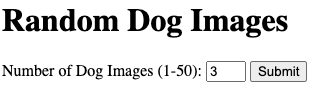
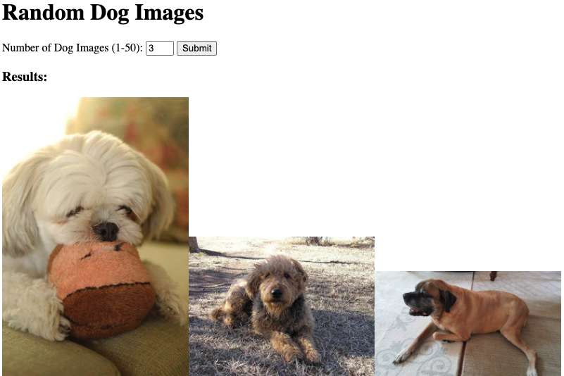

# dog-api

Practice assignment for working with APIs

## Live Demo

[Live Demo](https://7424243.github.io/dog-api/)

## Screenshots

### Search Section

### Results Section

## Summary

This was a practice assignment for Thinkful with the purpose of gaining more experience working with APIs. This app allows the user to specify how many random dog images they would like to be shown and then they are shown the specified number of images.

## Built With

* HTML
* CSS
* JavaScript
* jQuery
